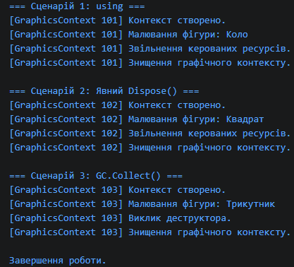

# Самостійна робота №1. Базовий синтаксис C# і оголошення класів

**Назва проєкту:** `IndependentWork1`  
**Дисципліна:** Об’єктно-орієнтоване програмування  

---

##  Опис проєкту
Консольний застосунок C#, створений для закріплення навичок оголошення класів, приватних полів, публічних властивостей (зокрема read-only), конструкторів, методів з обчислювальною логікою та індексатора.

---

##  Реалізовані класи

1. **`Rectangle` (Прямокутник)**
   * **Приватні поля:** `_width`, `_height`.
   * **Властивості:** `Width`, `Height`.
   * **Методи:** 
     * `CalculateArea()` — обчислення площі прямокутника.
     * `IsSquare()` — перевірка, чи є прямокутник квадратом.

2. **`Employee` (Працівник)**
   * **Приватні поля:** `_fullName`, `_monthlySalary`.
   * **Властивості:** `FullName` (read-only), `MonthlySalary`.
   * **Методи:** 
     * `CalculateAnnualBonus(double bonusPercent)` — обчислення річного бонусу від окладу.

3. **`Playlist` (Музичний плейлист)**
   * **Приватні поля:** `_title`, `_tracks` (масив рядків).
   * **Властивості:** `Title`.
   * **Індексатор:** `this[int index]` — доступ до треків за індексом `[]` із перевіркою меж масиву.
   * **Методи:** 
     * `PrintAllTracks()` — форматований вивід списку треків у консоль.

---
 