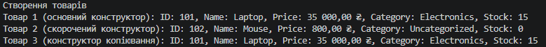

# Проєкт IndependentWork2: Перевантаження конструкторів

У проєкті реалізовано клас `Product` для системи інтернет-магазину із застосуванням перевантаження конструкторів та read-only властивостей.

### Організація класу `Product`:
* **Поля та Властивості:** Містить 5 read-only властивостей (`Id`, `Name`, `Price`, `Category`, `StockCount`).
* **Основний конструктор:** Приймає повний набір параметрів та ініціалізує всі поля.
* **Скорочений конструктор:** Приймає тільки `id`, `name`, `price`, делегуючи ініціалізацію основному конструктору через `: this(...)` зі значеннями за замовчуванням (`"Uncategorized"`, `0`).
* **Конструктор копіювання:** Створює дублікат існуючого об'єкта `Product`, перенаправляючи його значення в основний конструктор.
* **Форматоване виведення:** Перевизначено метод `ToString()` із грошовим форматуванням ціни (`Price:C`).

---

## Висновок

У ході виконання самостійної роботи було засвоєно практичні навички створення гнучких класів за допомогою перевантаження конструкторів:
1. Використання синтаксису `: this(...)` дозволило уникнути дублювання коду ініціалізації полів (принцип DRY — Don't Repeat Yourself).
2. Застосування read-only властивостей забезпечило незмінність (immutability) об'єктів `Product` після їх створення.
3. Перевизначення методу `ToString()` забезпечило зручне текстове представлення об'єкта під час виведення в консоль та налагодження.

---

