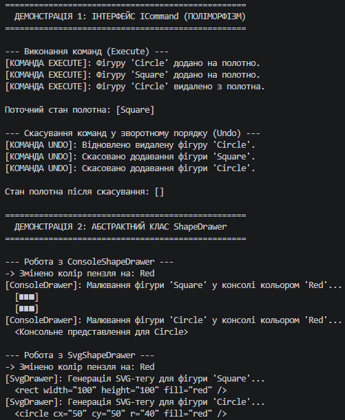

# Лабораторна робота №10 (Варіант 5)
**Тема:** Абстрактні класи та інтерфейси. Контракти та реалізації.

## Опис проєкту
Проєкт демонструє застосування інтерфейсів та абстрактних класів у мові C# на прикладі Варіанту 5:
1. **Інтерфейс `ICommand`** — реалізує паттерн Команда за допомогою класів `AddShapeCommand` та `RemoveShapeCommand`, забезпечуючи підтримку виконання (`Execute`) та скасування (`Undo`) дій.
2. **Абстрактний клас `ShapeDrawer`** — містить спільну логіку керування кольором пензля (`SetColor`) та абстрактний метод `DrawShape`, який специфічно реалізований у `ConsoleShapeDrawer` (вивід у консоль) та `SvgShapeDrawer` (генерація SVG-коду).

## Інструкція із запуску
1. Клонуйте репозиторій або перейдіть у директорію проєкту:
   ```bash
   cd OOP-Shevchenko/lab10v5
