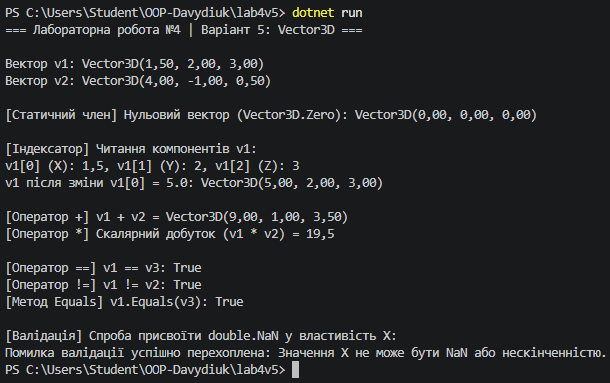

Лабораторна робота №4: Властивості та статичні члени. Індексатори й перевантаження операторів

Мета: Навчитися реалізовувати властивості з перевіркою, використовувати статичні члени класу, а також застосовувати індексатори та перевантажувати оператори для створення більш виразних та зручних класів.

Виконання роботи (Варіант 5 — Клас Vector3D)

Структура проєкту: Створено консольний проєкт lab4v5.

Реалізація класу:

Приватні поля: _x, _y, _z (координати вектора) та константа Epsilon для порівняння чисел із плаваючою крапкою.

Публічні властивості з валідацією: X, Y, Z з логікою перевірки на допустимість числових значень (блокування NaN та Infinity).

Статичний член: властивість Zero, що повертає нульовий вектор Vector3D(0, 0, 0).

Індексатор: this[int index] для зчитування та зміни компонентів вектора за індексами 0 (X), 1 (Y), 2 (Z).

Перевантажені оператори: додавання двох векторів (+), скалярний добуток векторів (*), оператори порівняння (==, !=).

Перевизначені методи: ToString(), Equals() та GetHashCode() для забезпечення семантичної цілісності при порівнянні об'єктів.

Результат роботи: У файлі Program.cs створено об'єкти класу Vector3D, продемонстровано використання статичної властивості Zero, роботу індексатора, виконання математичних операцій + та *, порівняння векторів, а також перехоплення помилки валідації при спробі присвоєння недопустимого значення.

Висновок до Лабораторної роботи №4

Під час виконання роботи я засвоїв розширені концепції ООП у C#: реалізацію властивостей із валідацією для збереження цілісності даних, використання статичних членів класу, застосування індексаторів для доступу до елементів об'єкта за індексом, а також перевантаження операторів і перевизначення методів ToString(), Equals() та GetHashCode() для створення зручних і математично коректних класів.
