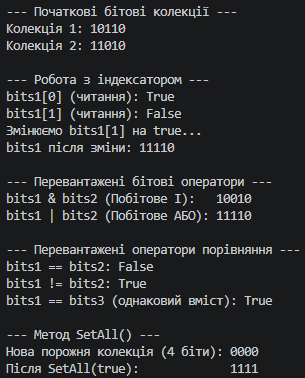

# Ієрархія класів банківських рахунків

У проєкті реалізовано наслідування класів `BankAccount` → `SavingsAccount` / `CheckingAccount`:
* **`BankAccount`** — базовий клас із полями, властивостями, конструктором та віртуальним методом `Deposit(decimal)`.
* **`SavingsAccount`** — ощадний рахунок, що додає власну процентну ставку `InterestRate`, унікальний метод `AddInterest()`, перевизначає `Deposit(...)` та приховує метод `GetAccountType()` за допомогою `new`.
* **`CheckingAccount`** — розрахунковий рахунок із лімітом овердрафту `OverdraftLimit`, власним методом `ProcessCheck()` та перевизначеним `Deposit(...)`.

---

## Висновок

У ході виконання роботи було практично засвоєно механізми наслідування, поліморфізму та приховування членів класу в мові C#:

1. **Конструктори базового класу (`base`):** Конструктори похідних класів успішно ініціалізують успадковані поля, викликаючи конструктор базового класу `BankAccount`.
2. **Перевизначення методів (`virtual` / `override`):** Забезпечено поліморфну поведінку. При роботі з масивом `BankAccount[]` виклик `Deposit(...)` динамічно активує потрібну реалізацію залежно від фактичного типу об'єкта.
3. **Приховування методів (`new`):** Продемонстровано, що метод з модифікатором `new` визначається **статично** за типом посилання. При виклику через змінну `SavingsAccount` викликається метод похідного класу, а при виклику через посилання `BankAccount` — метод базового класу.

---

