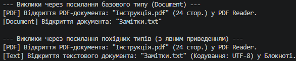

# Опис та аналіз роботи класів

У проєкті реалізовано ієрархію класів `Document` → `PDF` (override) / `Text` (new):
* **`Document`** — базовий клас із віртуальним методом `virtual void Open()`.
* **`PDF`** — похідний клас, що перевизначає метод `Open()` за допомогою модифікатора `override`.
* **`Text`** — похідний клас, що приховує метод `Open()` за допомогою модифікатора `new`.

## Висновок

У ході виконання роботи було досліджено відмінності між перевизначенням методів (`override`) та їх приховуванням (`new`):

* **Перевизначення (`override`):** Забезпечує **динамічне зв'язування** (поліморфізм). При виклику методу через посилання базового типу `Document` викликається реалізація з похідного класу `PDF`.
* **Приховування (`new`):** Використовує **статичне зв'язування**. При виклику методу через посилання базового типу `Document` викликається метод базового класу, а не похідного `Text`. Щоб викликати прихований метод похідного класу, необхідно виконати явне приведення типу `((Text)docRef).Open()`.

---

