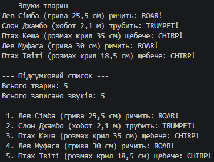

## Висновок

У ході виконання лабораторної работы було засвоєно практичні навички роботи з **поліморфізмом** та **динамічним зв'язуванням** у мові програмування C#:

* **Віртуальні методи та перевизначення:** Реалізовано базовий клас `Animal` із віртуальним методом `MakeSound()`, який був успішно перевизначений у похідних класах (`Lion`, `Elephant`, `Bird`) за допомогою модифікатора `override`.
* **Поліморфна поведінка:** Продемонстровано роботу з об'єктами різних похідних типів через єдину колекцію базового типу `List<Animal>`. При виклику методу `MakeSound()` у циклі програма динамічно (під час виконання) визначала фактичний тип об'єкта та викликала відповідну реалізацію.
* **Агрегація результатів:** Реалізовано збір та формування підсумкового списку результатів виконання поліморфних методів для всіх елементів колекції.

Використання поліморфізму дозволило створити гнучку структуру коду, яку легко розширювати шляхом додавання нових видів тварин без зміни логіки обробки списку.

