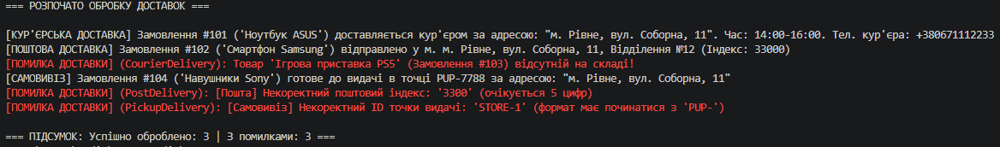

## Висновок

У ході виконання лабораторної роботи №9 було практично застосовано принцип поліморфізму в об'єктно-орієнтованому програмуванні на мові C# для створення гнучкої системи доставки товарів (`DeliveryService`).

**Основні результати роботи:**
1. **Проєктування архітектури:** Створено абстрактний базовий клас `DeliveryService` з абстрактним методом `Deliver(string address)` та спільною логікою перевірки наявності товарів на складі.
2. **Реалізація поліморфних класів:** Створено 3 похідні класи (`CourierDelivery`, `PostDelivery`, `PickupDelivery`), кожен з яких реалізує власний алгоритм доставки, унікальні властивості та специфічні правила валідації вхідних даних (формати номерів телефонів, поштових індексів та ID точок видачі).
3. **Обробка винятків:** Реалізовано власний клас винятків `DeliveryException`. У класі-сервісі `OrderDeliveryManager` забезпечено безпечну обробку помилок через блок `try-catch`, що дозволяє системі продовжувати обробку списку замовлень навіть у разі виникнення некоректних даних в окремих елементах.
4. **Робота з колекціями базового типу:** У методі `Main` продемонстровано можливість збереження різних типів доставок у єдиному списку `List<DeliveryService>` та їх однотипну поліморфну обробку в циклі без використання операторів приведення типів (`if-else`/`switch`).

Використання поліморфізму дозволило зробити систему розширюваною: додавання нового способу доставки (наприклад, `DroneDelivery`) не вимагатиме змін у вже існуючому коді сервісу `OrderDeliveryManager`.

